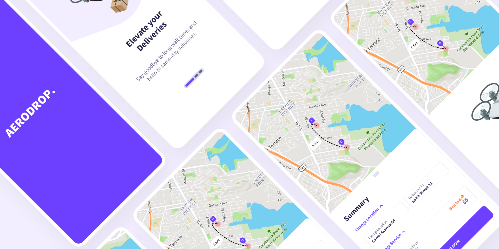

# 🛸 aerodrop

**Drone Delivery Service Mobile Interface**  
A sleek, modern mobile UI concept designed for the future of automated logistics and rapid drone delivery.

---

## 📸 Preview

<p align="center">
  
</p>

---

## 🧑‍💻 Setup

To initialize the project and generate the required assets, run the setup script located in the `scripts` directory:

```bash
cd scripts
./get_gen.sh
```

---

## ✨ Key Features

- **Real-time Drone Tracking**  
  Intuitive map-based interface for monitoring deliveries in real time.

- **Streamlined Ordering**  
  A frictionless checkout and ordering flow designed specifically for mobile users.

- **High-Fidelity UI**  
  Professional-grade components, smooth animations, and modern typography.

- **Future-Ready Concept**  
  Built to showcase next-generation automated logistics experiences.

---

## 🎖️ Design Credits

This project is based on the design work by **Krisna Wiyana**.

- **Designer Profile:** Figma Community (@krisnawiyana)
- **Design Title:** Drone Delivery Service Mobile Interface (FREE SAMPLE)
- **Platform:** Figma Community

All visual concepts and layouts belong to the original designer.  
This implementation is a mobile UI interpretation of that design.

---

## 📄 License

The source code in this repository is licensed under the  
[MIT License](LICENSE).

Please ensure you:

- Credit the original designer when showcasing this work
- Follow the Figma Community usage guidelines

---

### 🚀 Built With

- Flutter
- Modern UI principles
- Mobile-first design approach


## 🤝 Contributing

Contributions are welcome and appreciated!

If you'd like to improve this project, please:

1. Fork the repository
2. Create a new branch (`git checkout -b feature/amazing-feature`)
3. Commit your changes (`git commit -m "Add amazing feature"`)
4. Push to the branch (`git push origin feature/amazing-feature`)
5. Open a Pull Request

Please ensure your contributions:

- Follow the existing code style
- Do not break the UI design concept
- Include clear commit messages
- Keep changes focused and minimal

For major changes, please open an issue first to discuss what you would like to change.
